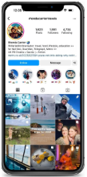
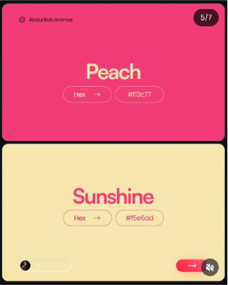
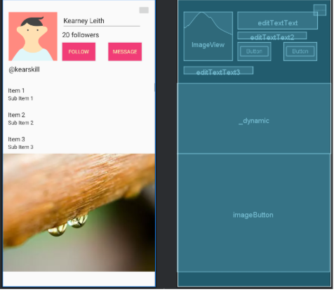
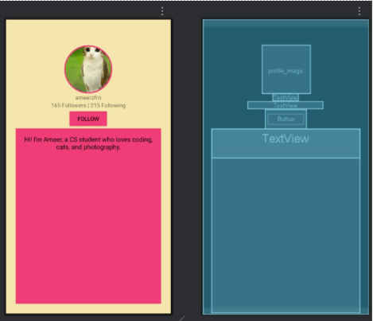
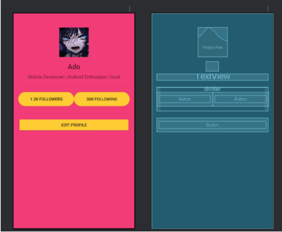
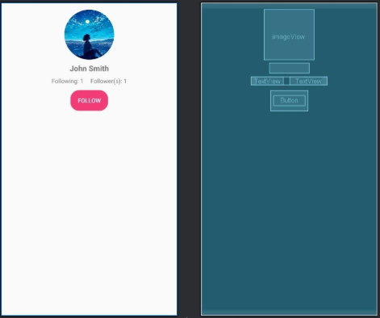
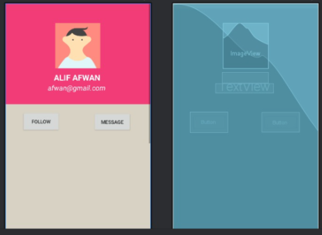
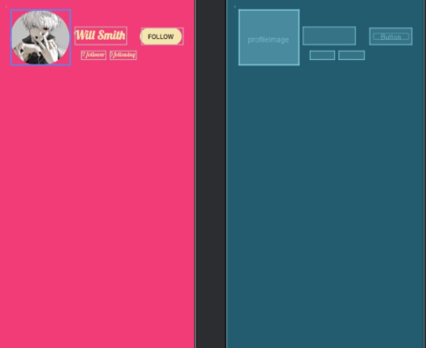

**Practical 2: The Profile Page**

## Task 1: Preparation
Form a team (or you can use your assignment grouping).
Choose ONE (1) Application from Google Play Store or Apple App Store (preferably your
favorite application)

## Task 2: Analyze and Draft

a. Using your own words, briefly introduce the mobile application.

b. By using three keywords, discuss and describe your main impression of the UI design of
this mobile application.
• For example: minimalist, fun, peaceful, natural, professional, etc.

c. Find out the target user of the mobile application. (The target user can be more than one,
e.g., elderly, children, working adults, young gamers.)

d. Let’s assume that your group is the developer team that develops this mobile application.
To appreciate the team’s efforts, your team leader proposes to credit everyone by putting
everyone’s profile in the last section.

| **Group Name**                    | gameLah                                                                                                                                                                                                                                                                          |
|-----------------------------------|----------------------------------------------------------------------------------------------------------------------------------------------------------------------------------------------------------------------------------------------------------------------------------|
| **Group Member**                  | (1) keni (2)A (3)r (4)AA (5)aa (6)n*bil (7)h                                                                                                                                                                                                             |
| **Mobile App Name**               | Instagram                                                                                                                                                                                                                                                                        |
| **Mobile App Screenshot**         |                                                                                                                                                                                                                                                                    |
| **Brief App Introduction**        | Instagram is a mobile-first social networking service that focuses on photo and video sharing. Users can upload media, apply filters, and organize content via profiles. Key features include an algorithmic feed, short-form video, temporary content, and direct messaging.    |
| **UI Design Keywords**            | 1) User control. Users can choose whom to chat with, create groups or mute/block contacts.  (2) Aesthetic (3) Simple. The interface is clean and easy to navigate. (4) Consistent, the color scheme (mainly peach and sunshine) and icons designs remain uniform. |
| **Target User**                   | 1) Youth and Young Adults 2)Content Creators and Influencers Businesses and Brands 4) Niche Communities                                                                                                                                                              |
| **Common UI Design for Team**     |                                                                                                                                                                                                                                                                    |
| **UI Draft for Group Member (1)** |                                                                                                                                                                                                                                                                    |
| **UI Draft for Group Member (2)** |                                                                                                                                                                                                                                                                    |
| **UI Draft for Group Member (3)** |                                                                                                                                                                                                                                                                    |
| **UI Draft for Group Member (4)** |                                                                                                                                                                                                                                                                    |
| **UI Draft for Group Member (5)** |                                                                                                                                                                                                                                                                    |
| **UI Draft for Group Member (6)** |                                                                                                                                                                                                                                                                    |
