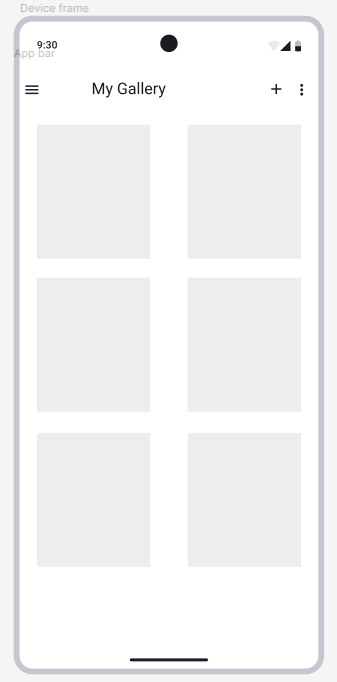

**Tutorial 7: App Bar and Bottom Navigation View**

1\. Using your own words, explain THREE (3) importance of App Bar.

The App Bar (aka Action Bar) serves as the anchor of a mobile application. Three key reasons for its importance include:

- Establishing Context: It provides immediate feedback on where
the user is within the app hierachy.
By displaying the current page title, it prevents the 
user from feeling "lost".

- Centralizing Primary Actions: It houses the most frequent used tools (like Search, Delete, or Share) in a consistent, predictable location, making the app intuitive to use.

- Navigational Consistency: It provides a standard way to move backward through the app's
hierarchy via the "Up" button, ensuring the user can always return to a previous screen without using
the device's hardware back button.

2\. You are tasked to develop a mobile application – the e-photo album. You have two activities in the e-photo album, (1) the all-photo view, and (2) the individual-photo view. Draft the App Bar for these two activities. In the App Bar, you need to have a suitable title, the relevant function icon(s), and the overflow menu.

| Activity            | Title             | Function Icons                    | Overflow Menu Items                        |
|---------------------|-------------------|-----------------------------------|--------------------------------------------|
| (1) All-Photo View  | My Gallery        | "Search, Add Photo"               | "Sort by Date, Select Multiple, Settings"  |
| (2) Individual View | [Photo Date/Name] | "Share, Favorite (Heart), Delete" | "Edit, Set as Wallpaper, Details/Metadata" |

.png)

3\. Identify the differences between side navigation view and bottom navigation view.
   Side Navigation (Drawer): 

| Side Navigation (Drawer)                                                                                                                                                                 | Bottom Navigation                                                                                                                |
|------------------------------------------------------------------------------------------------------------------------------------------------------------------------------------------|----------------------------------------------------------------------------------------------------------------------------------|
| A hidden panel that slides out. It is best for apps with many destinations (5+) or secondary features like "Profile," "Settings," and "Help" that don't need to be visible at all times. | A persistent bar at the bottom of the screen. It is designed for 3–5 top-level destinations that require direct, one-tap access. |

4\. Is it a must to have either side navigation view or bottom navigation view in a mobile application? Explain your answer by giving some examples.

It isn't a must. The requirement for side navigation view and bottom navigation view depends on the app's complexity.

- Example 1 (Single Purpose): A calculator or a weather app often lacks a navigation bar because the user performs all actions on a single screen.

- Example 2 (Linear Flow): A Setup Wizard or a Simple TImer app might use a simple "Back" and "Next" flow rather than a persistent navigation menu.

- Example 3 (Gestural App): Apps like TikTok or Instagram Stories use swipes rather than visible navigation buttons to move between primary content.

5\. BottomNavigationView is often used for app sections that are equally important to the user. Discuss:

a. What is the recommended maximum number of items in BottomNavigationView?

`The industry standard (Material Design) recommends a maximum of 5 items. Ideally, it should have between 3 and 5.`

b. What usability and design issues occur when you include too many items?

Usability and Design Issues
- Touch Targets: Too many icons result in small hit box, leading to accidental clicks.
- Visual Clutter: The bar becomes cramped, and labels may overlap or be cut off (ellipsized), making the UI look unprofessional.
- Cognitive Load: Giving a user 7 or 8 equally important choices at the bottom of the screen causes decision paralysis.

c. Suggest one alternative navigation strategy when an app needs more destinations than BottomNavigationView allows.

For more than 5 destinations, the Navigation Drawer (Side Menu) is the best alternative. 

d. Why is it bad practice to place the same action/icon in both the App Bar and Bottom Navigation? 

Placing the same icon (e.g. "Search") in both the App Bar and Bottom Navigation is considered bad practice because:

- Wasted Space: Using two slows for one function is inefficient.
- User Confusion: Users may wonder if the two identical icons do different things (e.g. "Does the top one search photos, and the bottom one search the web?). It breaks the principle of one clear path per action.

